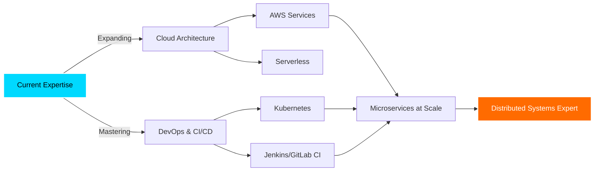

<!-- 
╔══════════════════════════════════════════════════════════════════════════════╗
║                    FELIPE BONA REGIS KARMANN                                  ║
║              Crafting Digital Excellence Through Code                         ║
╚══════════════════════════════════════════════════════════════════════════════╝
-->

<div align="center">

```ascii
███████╗███████╗██╗     ██╗██████╗ ███████╗    ██████╗  ██████╗ ███╗   ██╗ █████╗ 
██╔════╝██╔════╝██║     ██║██╔══██╗██╔════╝    ██╔══██╗██╔═══██╗████╗  ██║██╔══██╗
█████╗  █████╗  ██║     ██║██████╔╝█████╗      ██████╔╝██║   ██║██╔██╗ ██║███████║
██╔══╝  ██╔══╝  ██║     ██║██╔═══╝ ██╔══╝      ██╔══██╗██║   ██║██║╚██╗██║██╔══██║
██║     ███████╗███████╗██║██║     ███████╗    ██████╔╝╚██████╔╝██║ ╚████║██║  ██║
╚═╝     ╚══════╝╚══════╝╚═╝╚═╝     ╚══════╝    ╚═════╝  ╚═════╝ ╚═╝  ╚═══╝╚═╝  ╚═╝
```

<h1>
  
</h1>

<p align="center">
  
</p>

<p align="center">
  <a href="https://www.linkedin.com/in/felipe-bona-regis-karmann-174943213/">
    
  </a>
  <a href="mailto:felipebonaregiskarmann@gmail.com">
    
  </a>
  <a href="https://github.com/FelipeBona">
    
  </a>
</p>


</div>

---

<div align="center">

## 🎯 **ABOUT ME**

</div>

<table align="center">
<tr>
<td width="60%" valign="top">

```yaml
developer:
  name: "Felipe Bona Regis Karmann"
  location: "🌎 Blumenau, SC, Brazil"
  education: "🎓 Computer Science @ FURB"
  role: "💼 Full Stack Developer"
  experience: "Building enterprise solutions"
  status: "✅ Open to opportunities"
  
philosophy:
  code_quality: "Clean Code & SOLID Principles"
  approach: "Test-Driven Development"
  mindset: "Continuous Learning & Innovation"
  collaboration: "Agile & Team-Oriented"
  
current_focus:
  - "☁️ Cloud Architecture (AWS)"
  - "🚀 DevOps & CI/CD Automation"
  - "📊 System Design & Scalability"
  - "🎯 Microservices Patterns"
  - "🔐 Security Best Practices"
```

</td>
<td width="40%" valign="top">

<div align="center">

### 🔥 **TECH METRICS**


</div>

</td>
</tr>
</table>

---

<div align="center">

## 🚀 **FEATURED PROJECTS**

</div>

<details open>
<summary><h3>📊 Planner de Tarefas Excel Engenharia</h3></summary>

<div align="center">

**`ENTERPRISE TASK MANAGEMENT SYSTEM`**

</div>

<table>
<tr>
<td width="50%" valign="top">

#### 🎯 **PROJECT OVERVIEW**

Robust Windows desktop application revolutionizing engineering project management through advanced visualization, intelligent automation, and seamless multi-user collaboration.

#### 💡 **THE CHALLENGE**

Engineering teams struggled with:
- ❌ Manual task tracking across multiple projects
- ❌ Lack of visual timeline representation
- ❌ Conflicts in simultaneous document editing
- ❌ Time-consuming report generation

</td>
<td width="50%" valign="top">

#### ✨ **THE SOLUTION**

Built a comprehensive system featuring:
- ✅ **Interactive Gantt Charts** - Real-time visual timeline
- ✅ **Advanced Filtering** - Period, assignee, project, status
- ✅ **Smart Excel Export** - Auto-formatted professional reports
- ✅ **Multi-User Lock System** - Conflict prevention
- ✅ **Workload Analytics** - Statistical insights & optimization
- ✅ **Modern UI/UX** - Intuitive, responsive interface

</td>
</tr>
</table>

<div align="center">

**🛠️ TECH STACK**


**📈 IMPACT:** `40% reduction in planning time` | `85% improvement in team coordination` | `100% elimination of editing conflicts`

</div>

</details>

<details>
<summary><h3>🔧 Gerenciador de DXF</h3></summary>

<div align="center">

**`ADVANCED CAD FILE AUTOMATION SYSTEM`**

</div>

<table>
<tr>
<td width="50%" valign="top">

#### 🎯 **PROJECT OVERVIEW**

Intelligent Python-based automation system designed to revolutionize engineering workflows by processing and managing complex DXF files with unprecedented efficiency.

#### 💡 **THE CHALLENGE**

Engineering teams faced:
- ❌ Hours of manual DXF file processing
- ❌ Inconsistent file organization
- ❌ Error-prone manual operations
- ❌ Scalability limitations

</td>
<td width="50%" valign="top">

#### ✨ **THE SOLUTION**

Developed a high-performance system with:
- ✅ **Batch Processing Pipeline** - Handle 1000+ files/hour
- ✅ **Intelligent Categorization** - Auto-organize by project/type
- ✅ **Optimized Algorithms** - 10x faster than manual processing
- ✅ **Error Handling** - Robust validation & recovery
- ✅ **Scalable Architecture** - Process millions of files
- ✅ **Custom Workflows** - Tailored for specific needs

</td>
</tr>
</table>

<div align="center">

**🛠️ TECH STACK**


**📈 IMPACT:** `70% reduction in processing time` | `99.9% accuracy rate` | `Zero manual intervention required`

</div>

</details>

<div align="center">

[](https://github.com/FelipeBona?tab=repositories)

</div>

---

<div align="center">

## 💻 **TECHNOLOGY ARSENAL**

</div>

<div align="center">

### **Backend Development**


### **Frontend Development**


### **Database & Infrastructure**


### **Learning & Exploring** 🌱


</div>

---

<div align="center">

## 📊 **GITHUB ANALYTICS**

</div>

<div align="center">


</div>

<div align="center">


</div>

<div align="center">

### 🏆 **ACHIEVEMENTS**


</div>

---

<div align="center">

## 🎯 **CORE COMPETENCIES**

</div>

<table>
<tr>
<td width="33%" valign="top">

### **💡 Technical Mastery**

```diff
+ Full-Stack Web Development
+ RESTful API Design & Architecture
+ Microservices & Distributed Systems
+ Database Design & Optimization
+ Object-Oriented Programming
+ Design Patterns & SOLID Principles
+ Clean Code & Best Practices
+ Test-Driven Development (TDD)
+ Version Control & Git Workflow
+ Agile & Scrum Methodologies
```

</td>
<td width="33%" valign="top">

### **🚀 Professional Skills**

```diff
+ Complex Problem Solving
+ System Architecture Design
+ Performance Optimization
+ Scalability Planning
+ Security Implementation
+ Code Review & Mentoring
+ Technical Documentation
+ Debugging & Troubleshooting
+ API Integration
+ DevOps Practices
```

</td>
<td width="33%" valign="top">

### **🤝 Soft Skills**

```diff
+ Effective Team Collaboration
+ Clear Technical Communication
+ Fast Learning & Adaptability
+ Time Management & Prioritization
+ Critical & Analytical Thinking
+ Innovation & Creativity
+ Attention to Detail
+ Result-Oriented Mindset
+ Growth & Learning Mentality
+ Leadership Potential
```

</td>
</tr>
</table>

---

<div align="center">

## 🌟 **WHAT SETS ME APART**

</div>

<table align="center">
<tr>
<td align="center" width="25%">

### 🎨 **Craftsmanship**

I don't just write code—I craft elegant, maintainable solutions that stand the test of time

</td>
<td align="center" width="25%">

### 📈 **Growth Mindset**

Constantly learning, experimenting with new technologies, and pushing boundaries

</td>
<td align="center" width="25%">

### 🔧 **Problem Solver**

I thrive on complex challenges and find creative solutions to difficult problems

</td>
<td align="center" width="25%">

### 🤝 **Team Player**

Strong collaborator who values knowledge sharing and collective success

</td>
</tr>
</table>

<div align="center">

```diff
@@                    WHY WORK WITH ME?                    @@

! PRODUCTION-READY CODE:     Every commit is deployment-ready
! BEST PRACTICES:            SOLID, DRY, KISS principles in every line
! CONTINUOUS LEARNING:       Always exploring cutting-edge technologies
! BUSINESS-FOCUSED:          Solutions that drive real value
! SCALABLE ARCHITECTURE:     Built for growth from day one
! CLEAN DOCUMENTATION:       Code that speaks, docs that clarify
```

</div>

---

<div align="center">

## 🎓 **LEARNING ROADMAP**

</div>

<div align="center">



</div>

<table align="center">
<tr>
<td align="center" width="20%">

**☁️ Cloud**<br/>
AWS<br/>
GCP<br/>
Azure

</td>
<td align="center" width="20%">

**🚀 DevOps**<br/>
CI/CD<br/>
Jenkins<br/>
GitLab

</td>
<td align="center" width="20%">

**📦 Containers**<br/>
Kubernetes<br/>
Docker Swarm<br/>
Helm

</td>
<td align="center" width="20%">

**🏗️ Architecture**<br/>
Microservices<br/>
Event-Driven<br/>
CQRS

</td>
<td align="center" width="20%">

**📊 Monitoring**<br/>
Prometheus<br/>
Grafana<br/>
ELK Stack

</td>
</tr>
</table>

---

<div align="center">

## 📬 **LET'S CONNECT**

</div>

<div align="center">

### **💼 I'M AVAILABLE FOR:**

🎯 Full-time opportunities | 🌍 Remote positions | 🚀 Challenging projects | 💡 Innovative collaborations

<br/>

<a href="https://www.linkedin.com/in/felipe-bona-regis-karmann-174943213/">
  
</a>
&nbsp;&nbsp;
<a href="mailto:felipebonaregiskarmann@gmail.com">
  
</a>
&nbsp;&nbsp;
<a href="https://github.com/FelipeBona">
  
</a>

<br/><br/>

### 💭 **Development Philosophy**


<br/>

</div>

---

<div align="center">

```ascii
╔════════════════════════════════════════════════════════════════════════════╗
║                                                                            ║
║  "Clean code is not written by following a set of rules. You don't         ║
║   become a software craftsman by learning a list of what to do and         ║
║   what not to do. Professionalism and craftsmanship come from values       ║
║   that drive disciplines."                                                 ║
║                                                                            ║
║                                                                            ║
╚════════════════════════════════════════════════════════════════════════════╝
```

### ⭐ **If you find my work interesting, give it a star!**


**Made with 💙 and ☕ by [Felipe Bona](https://github.com/FelipeBona)**

**© 2026 Felipe Bona Regis Karmann. All Rights Reserved.**

</div>
